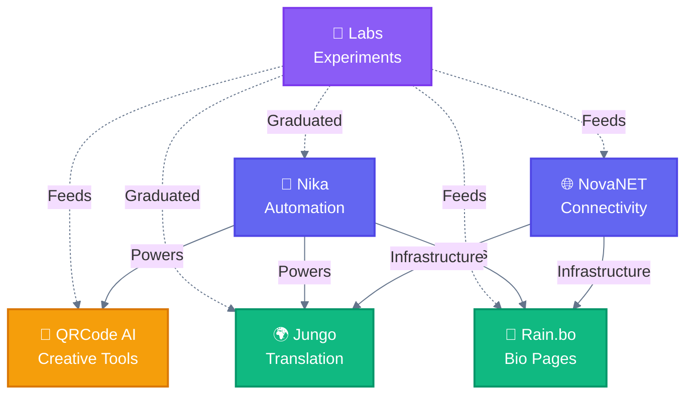

# SuperNovae ☄️🏴‍☠️

**Building an empire of consumer products, massively adopted, recognized for quality, design, and simplicity — while staying intentionally small.**

[Hub](https://github.com/supernovae-ai/hub) · [Open Source](https://github.com/supernovae-ai/hub/blob/main/OPEN-SOURCE-INDEX.md) · [Inspirations](https://github.com/supernovae-ai/hub/blob/main/INSPIRATIONS.md)

---

## Our Universes 🌌

|  | Universe | Description |
|--|----------|-------------|
| 🔲 | [**QRCode AI**](https://github.com/supernovae-ai/qrcode-ai) | AI-powered artistic QR code generation |
| 🤖 | [**Nika**](https://github.com/supernovae-ai/nika) | Native Infrastructure Kernel for Automation |
| 🌐 | [**NovaNET**](https://github.com/supernovae-ai/novanet) | Network & connectivity solutions |
| 🌍 | [**Jungo**](https://github.com/supernovae-ai/jungo) | Translation & SEO language engine |
| 🌈 | [**Rain.bo**](https://github.com/supernovae-ai/rain-bo) | Link-in-bio widget pages |
| 🧪 | [**Labs**](https://github.com/supernovae-ai/supernovae-labs) | Internal tools & experiments |

### The Constellation ⭐

---

## Philosophy 🏴‍☠️

> *"We stay small by choice of freedom, not by constraint."*

- **Product-Obsessed, Consumer-First** — Even what's invisible must be simple, elegant, and delightful
- **Quality Creates Adoption** — Adoption creates longevity
- **Taste-Driven, Not A/B Tested** — Decisions by conviction
- **Build in Public** — When it creates trust, not noise

📚 Read our [Manifesto](https://github.com/supernovae-ai/hub/blob/main/MANIFESTO.md) and [Principles](https://github.com/supernovae-ai/hub/blob/main/PRINCIPLES.md)

---

## The Crew 🚀

<table>
  <tr>
    <td align="center">
      <a href="https://github.com/ThibautMelen">
        
         
        <b>Thibaut</b>
      </a>
    </td>
    <td align="center">
      <a href="https://github.com/NicolasCELLA">
        
         
        <b>Nicolas</b>
      </a>
    </td>
  </tr>
</table>

Built with 💜 by the SuperNovae crew — Paris ☄️🏴‍☠️

