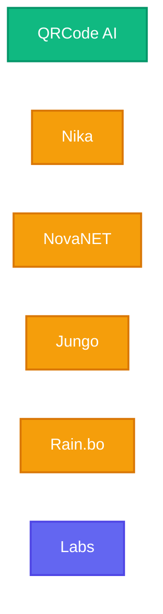

# SuperNovae Studio

**Building an empire of consumer products — massively adopted, recognized for quality, design, and simplicity — while staying intentionally small.**

 

---

## Our Universes

| Universe | Description | Status |
|----------|-------------|--------|
| [**QRCode AI**](https://qrcode-ai.com) | AI-powered artistic QR codes | **Live** |
| [**Nika**](https://github.com/supernovae-st/nika) | Native Infrastructure Kernel Agent | Building |
| [**NovaNET**](https://github.com/supernovae-st/novanet) | Knowledge graph localization | Building |
| [**Jungo**](https://github.com/supernovae-st/jungo) | Translation & SEO engine | Building |
| [**Rain.bo**](https://github.com/supernovae-st/rain-bo) | Link-in-bio pages | Building |
| [**Labs**](https://github.com/supernovae-st/supernovae-labs) | Internal tools & experiments | Active |

---

## Philosophy

> *"We stay small by choice of freedom, not by constraint."*

| Principle | What It Means |
|-----------|---------------|
| **Product-Obsessed** | Even what's invisible must be simple, elegant, and delightful |
| **Quality Creates Adoption** | Adoption creates longevity |
| **Taste-Driven** | Decisions by conviction, not A/B tests |
| **Build in Public** | When it creates trust, not noise |
| **Stay Small** | Use AI & automation for leverage, not headcount |

---

## Open Source

| Repository | Description |
|------------|-------------|
| [**qrcode-ai-scanner**](https://github.com/supernovae-st/qrcode-ai-scanner) | High-performance QR scanner (89% success on artistic QR codes) |
| [**hub**](https://github.com/supernovae-st/hub) | Our philosophy, principles, and culture |
| [**novanet**](https://github.com/supernovae-st/novanet) | Knowledge graph localization orchestrator |

---

## The Crew

| | |
|:-:|:-:|
|  |  |
| **[Thibaut](https://github.com/ThibautMelen)** | **[Nicolas](https://github.com/NicolasCELLA)** |
| Co-founder | Co-founder |

**Small crew vs giants — and we win.**

---

*Small crew, massive impact.*

